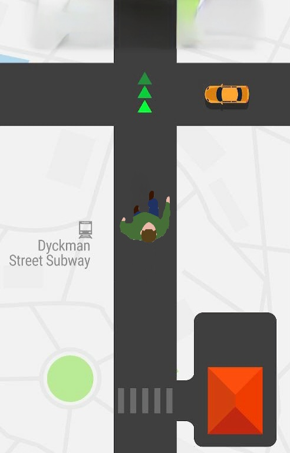
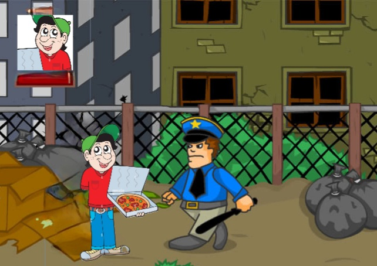

### Name of the project:
Simulator Yandex.Deliver (Полина Роману: наверное, стоит по-другому назвать)

###  Team Lead:
Project Developers: Polina Backhman, Yashin Roman  
Teacher: Anatolyev Alexey Vladimirovich

### Description of the program and Project Description
Цель проекта:  
Создание игры-симулятора по доставке еды. Курьеру необходимо аккуратно
и безопасно довезти заказ до необходимого места. (Полина Роману: наверное, стоит по-другому поставить цель)

Процесс работы программы:  
А) Description of the program; Б) Project Description 

1.а) Открывается стартовое окно. С реализованным кнопками (см.(Б)) Также будут доступны 
несколько скинов для доставщика, которые можно прокручивать с помощью
стрелок и покупать на заработанные монеты.  
1.б) В окне есть кнопки вида: «Начать игру», «Выход», «Справка по игре»,
«Выбрать уровень». 
  
2.а) Нажатие кнопки «Начать игру».  
2.б) Процесс запуска класса отвечающего за игру, 
по умолчанию с первого уровня или уровня на котором остановился пользователь.  
  
3.а) Нажатие кнопки «Выход».  
3.б) Завершение работы окна PyGame, его закрытие.  
  
4.а) Нажатие кнопки «Справка по игре».  
4.б) Появление справки по управлению игрой, авторы, ссылка на проект GitHub  
  
5.а) Нажатие кнопки «Выбрать уровень».  
5.б) Выбор одного из трех уровней игры, доступны все, перенаправление классов.  
  
6.а) 1-ый уровень. Главной задачей является довезти заказ до клиента и заработать как можно больше монет за него.
Клиент проговаривает свой заказ и игроку надо его запомнить. 
Перед началом поездки появляется три ланч-бокса яндекс.доставки, при зажатии правой кнопки мыши
над ними всплывает окошко, где нарисованы возможные продукты из заказа клиента,
для того, чтобы выбрать сумку надо кликнуть один раз по ней. 
В процесс доставки надо не попасть под машину и соблюдать правила дорожного
движения, чтобы довезти заказ до места назначения. 
В игре предусмортены штрафы за превышение лимита времени на заказ,
за доставку неправильного заказа, а также клиент может дать чаевые,
если верный заказ был выполнен за минимальное время.  
6.б) Реализована одна локация - дорога. 
Машины - объекты, с которыми может столкнуться игрок. 
Время, монеты, скорость, путь до места назначения заказа - то, 
что подсчитывает программа, выводится сверху (кроме монет).
Аудио воспроизведение заказа. 
  
7.а) 2-ой уровень. Добавления: плохая погода, туман может появиться
и резко понизить видимость. Для избавления необходимо прокрутить колесо мыши.
7.б) Добавлено новое испытание, реализованная функция исчезновения и появления тумана.
(изменение яркости или прозрачности)  
  
8.а) 3-ий уровень. Добавления: злой полицейский, который появился из тумана
и потребовал документы, которых у доставщика не оказалось. 
Теперь вы отправляетесь в другую локацию, чтобы побороть его. Придется немного подраться. (Полина вызывает Романа)
8.б) Добавлена новая локация, герой...  
  
9.а) Реализовано финальное окно. На нем показано время игры, максимальная скорость 
и кол-во монет/штраф, которое он получил за доставленный/недоставленный заказ. А также кнопки (см.(Б))
9.б) В окне есть результат игры (см.(9.А)) и кнопки вида: «Следующая игра», «Выход», «Вернуться на стартовое окно». 
С соответствующими функциями по названию кнопок.  
  
12.а) Нажатие кнопки «Следующая игра».  
12.б) Переход к следующему уровню, если это возможно, 
без изменения каких-либо параметров для игры.    
  
13.а) Нажатие кнопки «Вернуться на стартовый экран».  
13.б) Возвращение игрока на начальное окно, где можно при переходе 
на новый уровень выбрать новый скин персонажа 
(новый скин становится доступным при прохождении уровня). 
Переброс игрока на пункт 1.а.  
  
14.а) Нажатие кнопки «Выход».  
14.б) Завершение работы окна PyGame, его закрытие.  

### Program code plan.

a. Переменные, константы: Глобальные переменные скорее всего не понадобятся, 
т.к. все необходимые данные будут инициализироваться. Эти данные представлены
отдельными переменными со счетчиками монет, времени, пути, скорости и штрафов.  
b. Функции: озвучки заказа клиента; выбора ланч-бокса с заказом; доставки еды на карте; 
столкновения машины и курьера; рассеивания и появления тумана; борьбы с полицейским; 
вывода стартового и начального окна.  
(Роман хочет помочь Полине с функциями)  
c. Классы: Всего 4 класса. 1-ый класс показывает стартовое окно. Во 2-ом реализованы события с дорогой, туманом, выбором ланч-бокса. 
3-ий класс исполняет все функции связанный с борьбой против злого полицейского.  
Последний класс показывает результаты игры (финальное окно).  
d. Библиотеки: numpy or math, datatime для отображения времени выполнения доставки и счета других параметров.  

### Grafical interface

- Дорога курьера к месту доставки заказа

- Самое сложное испытание во всех уровнях, сражение с полицейским.

### Deadlines

| Задача                                         | Дата       |
|------------------------------------------------|------------|
| Техническое задание (ТЗ)                       | 17 декабря |
| Код + Большая часть проекта                    | 4 января   |
| Код почти работает + черновики презентации, ПЗ | 8 января   |
| Всё готово                                     | 16 января  |