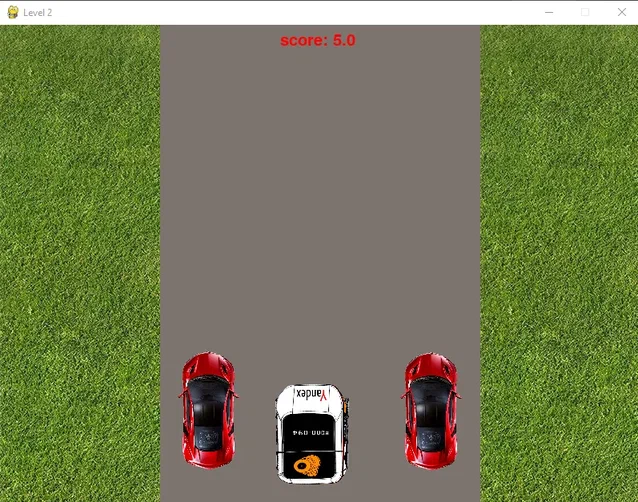
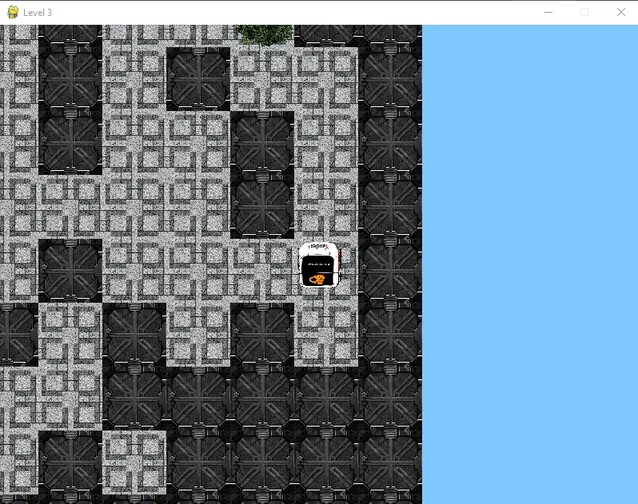

### Name of the project:  
# Yandex Delivery Simulator

### Project Purpose
Игра создана с целью попробовать провезти заказ с помощью Яндекс.Ровера 
и почувствовать себя в роли курьера,
нужно пройти три уровня (головоломка, гонка, лабиринт).

### Кол-во строк в проекте
265 строк кода в main.py  
411 строк кода в level1.py  
385 строк кода в level2.py  
272 строки кода в level3.py  
Итого: 1333 строки кода в проекте

### Ссылка на [**техническое задание**](materials/technical_specification.md)

### Установка и запуск

Для запуска приложения с использованием интерпретатора python рекомендуется использовать python3.9.
Предварительно необходимо установить все внешние библиотеки.

```sh
$ pip install -r requirements.txt
```

### Процесс работы программы

- Запуск и открытие основного меню.
В меню находятся основные кнопки с отображенными в названиях функциями


- Кнопка "ВЫБОР УРОВНЯ"
Эта кнопка позволяет пользователю начать 
игру не с начала, а с любого выбранного им уровня. 
Реализован выбор любого уровня и его открытие
Также кнопка "ГЛАВНОЕ МЕНЮ" возвращает пользователя к стартовому окну


- Кнопка "ИНСТРУКЦИЯ"
Эта кнопка позволяет ознакомиться игроку
с подробным руководством по использованию программы.
Прописан текст, помогающий при работе с игрой.


- I УРОВЕНЬ.  
У кого не было случая, когда в ваш заказ положили
что-то совершенно не относящееся к желаемому? На этом уровне твоя 
задача - правильно собрать один заказ. Заказ можно услышать при 
нажатии на Рому и для выполнения задания его необходимо запомнить. 
Чтобы перетащить продукт в Яндекс.Ровер, нужно зажать его левой
кнопкой мыши и поместить в центр робо-станции. Слева появляется
список продуктов, которые ты положил в робо-станцию. Для того 
чтобы очистить список, и начать заново собирать заказ - нажми на кнопку
"отмена". Если хочешь проверить свой заказ - нажми на кнопку "проверить".
При успешном выполнении задания, у тебя получится пройти на следующий уровень.  
Реализованы функции по перетаскиванию предметов, включении рандомных 
заказов с собственной озвучкой, а также отмены и проверки правильности
списка, положенного в Яндекс.Ровер.


- II УРОВЕНЬ.  
Наверняка, у каждого заказ приходил невовремя или задерживался. 
Ведь сколько неприятностей может встретиться курьеру по дороге. 
Твоя цель - доехать на робо-станции до финиша, не врезавшись ни в 
одну встречную машину и не задев обочины. Осторожно! Скорость 
робо-станции постоянно растет! За ее изменением ты можешь наблюдать
в верхнем параметре "score". Для того, чтобы управлять робостанцией
нажимай на клавиши навигации на клавиатуре: "left", "right".  
Представлены функции по передвижению машинки, её столкновению 
со встречными, а также увеличению скорости машин.




- III УРОВЕНЬ.  
Бывает, самое сложное в работе курьера, становится поиск нужного
подъезда или дома. Попробуй и ты, пройти наш лабиринт. Для того
чтобы перемещать Яндекс.Ровер, используй клавиши навигации на клавиатуре:
"left", "right", "up", "down". Не удивляйся, если робо-станция станет
прозрачной, она также сохраняет этот эффект до тех пор, пока ты 
зажимаешь клавишу. Постарайся пройти лабиринт, как можно за меньшее
время!
Сформирована карта из текстового файла, как клеточное поле, контролируются 
столкновения с железными ящиками и водой, также изменяется прозрачность
вблизи кустов, считается время, во время которого пользователь проходит игру.



При прохождении нашей игры, ты поймешь, насколько трудна работа курьеров. 
А еще, наша команда будет очень рада, если мы получим довольно высокий балл♡

### Ссылка на [**скриншоты и скринкасты**](https://disk.yandex.ru/d/wzsImk2ppxJXQg)

### Ссылка на [**проект на GitHub**](https://github.com/PolinaBack/PYGAME_PROJECT)